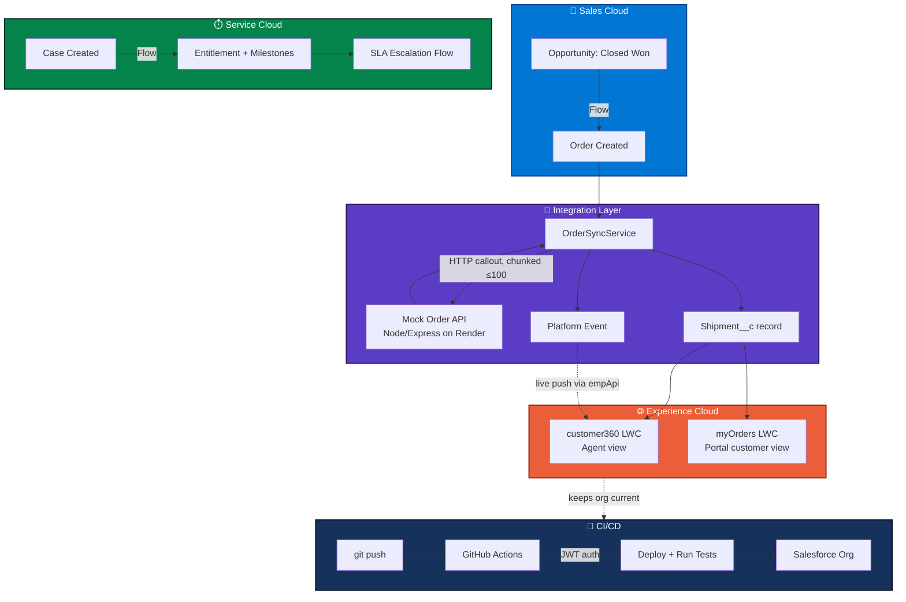
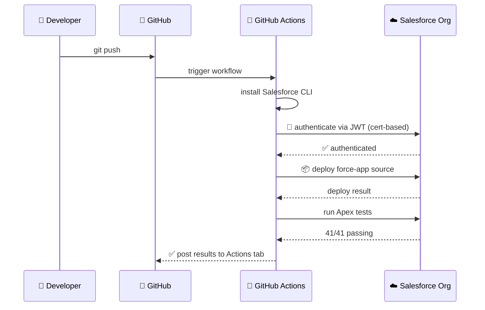

<div align="center">

# 🔗 Unified Customer Experience Platform

### Sales Cloud + Service Cloud + Experience Cloud, connected — with SLA automation, a live integration, and a self-deploying CI/CD pipeline


</div>

---

## 📑 Table of Contents

- [🎯 The Problem](#-the-problem)
- [🗺️ Architecture](#️-architecture-at-a-glance)
- [✨ What's Built](#-whats-built)
- [🚀 CI/CD Pipeline](#-cicd-pipeline)
- [🧪 Testing Strategy](#-testing-strategy)
- [⚠️ Known Limitations](#️-known-limitations)
- [🛠️ Tech Stack](#️-tech-stack)
- [🎬 Demo](#-demo)
- [⚡ Setup](#-setup)

---

## 🎯 The Problem

Sales and Service typically run as disconnected systems: agents have no visibility into what a customer bought, SLAs go untracked, and customers have no way to self-serve. This project closes those gaps in one connected platform.

---

## 🗺️ Architecture at a Glance



---

## ✨ What's Built

<details open>
<summary><b>🗂️ Data Model</b></summary>
<br>

Custom `Shipment__c` object, `Order`↔`Opportunity` and `Case`↔`Order` lookups, standard Order/Product2/Entitlement objects.
</details>

<details open>
<summary><b>🔐 Security</b></summary>
<br>

Permission Sets (Sales Rep, Service Agent, Portal Customer), Org-Wide Defaults, sharing rules, and **Apex-managed sharing** (`Shipment__Share`) for cases where declarative role-based sharing didn't propagate reliably.
</details>

<details open>
<summary><b>💼 Sales Cloud Automation</b></summary>
<br>

Flow auto-creates an Order — with real Order Products/line items — the moment an Opportunity is marked **Closed Won**.
</details>

<details open>
<summary><b>⏱️ Service Cloud SLA</b></summary>
<br>

Entitlement Process with Milestones:

| Milestone | Target |
|---|---|
| First Response | 240 min |
| Resolution | 960 min |

Auto-populated on new Cases via Flow, with a scheduled escalation Flow for breached SLAs.
</details>

<details>
<summary><b>📞 Omni-Channel</b></summary>
<br>

Service Channel, Queues, and Routing Configuration for real-time case routing.

⚠️ *Live agent presence activation hits a Developer Edition trial org limitation — full routing configuration is in place and would activate on a standard Sales/Service Cloud license.*
</details>

<details open>
<summary><b>🔄 Integration</b></summary>
<br>

A mock external order/shipment API (Node/Express, deployed on Render), called via a bulk-safe Apex service (`OrderSyncService`) with **95%+ test coverage**, chunked to respect Salesforce's 100-callout-per-transaction governor limit via queueable chaining, a Platform Event for real-time updates, a Scheduled Apex job (Scheduler→Queueable pattern, working around Salesforce's callout-from-scheduled-Apex restriction), and a manual "Sync Now" button (Screen Flow + Quick Action).
</details>

<details open>
<summary><b>🌐 Experience Cloud</b></summary>
<br>

A live customer portal (Customer Community Plus license) with authenticated login and sharing rules granting customers visibility into their own Cases, Orders, and Shipments.
</details>

<details open>
<summary><b>🖥️ Agent-Facing LWC — <code>customer360</code></b></summary>
<br>

On the Account page — shows Account, Opportunities, Orders, and Shipments, plus color-coded SLA Milestone countdowns and a **live Platform Event subscription** (via `lightning/empApi`) that auto-refreshes the view the instant an order status changes elsewhere in the system.
</details>

<details open>
<summary><b>📱 Customer-Facing LWC — <code>myOrders</code></b></summary>
<br>

On the portal Home page — shows each customer's Orders and Shipment tracking status, fully respecting sharing rules.
</details>

<details open>
<summary><b>📊 Reports & Dashboards</b></summary>
<br>

Pipeline by Stage · Case Resolution Time · SLA Compliance Rate · Cases by Origin · `UCE Platform Overview` dashboard — version-controlled in this repo, not just live in the org.
</details>

---

## 🚀 CI/CD Pipeline

This project deploys and tests **itself**, automatically, on every push to `main`:



**Auth method:** JWT bearer flow — a self-signed certificate registered on a Salesforce External Client App, private key stored as a GitHub secret. No password ever entered, no human in the loop.

📄 Workflow file: [`.github/workflows/deploy.yml`](.github/workflows/deploy.yml)

> 🐛 **Real bugs this pipeline caught before they shipped:**
> - A scheduled-job naming collision that only surfaced against an org with a live scheduled job already running
> - A missing object/field permission (+ a stale "In Development" status) silently blocking portal users from seeing their own Shipments — invisible to admin testing, caught immediately by a test running as the actual portal user

---

## 🧪 Testing Strategy

<div align="center">

| Metric | Result |
|:---:|:---:|
| Custom Apex coverage | **95–97%** ✅ |
| Org-wide coverage | 81% ℹ️ |
| Tests passing | **41 / 41** ✅ |
| Real callouts in tests | **Zero** 🚫 |

</div>

*Org-wide figure is pulled down by bundled Salesforce Experience Cloud controllers that aren't part of this project's code.*

- ✅ `HttpCalloutMock` used throughout — no test ever makes a real callout
- ✅ Bulk tests exercise real governor-limit boundaries (100-record callout ceiling), not arbitrary small numbers
- ✅ Negative/edge cases covered: failed callouts, non-existent record Ids, empty input lists
- ✅ `OrderSyncQueueable` chunks any batch over 100 orders and chains itself via `System.enqueueJob` — a bug the bulk tests found directly, fixed as a result

---

## ⚠️ Known Limitations

- **Omni-Channel live presence** — routing config complete, but live agent presence activation is blocked by a Developer Edition trial limitation
- **CI/CD deploys to a persistent dev org**, not a disposable scratch org per run — a deliberate simplification for a solo project. A team setting would add feature branches, PR review, and per-PR scratch org validation before merging to `main`

---

## 🛠️ Tech Stack

<div align="center">

`Apex` · `Lightning Flow` · `Lightning Web Components` · `Experience Cloud` · `Platform Events` · `Named Credentials` · `Node.js/Express` · `GitHub Actions` · `JWT Auth` · `SFDX` · `Git`

</div>

---

## 🎬 Demo

- **Customer Portal:** [orgfarm-a1be47f661-dev-ed.develop.my.site.com](https://orgfarm-a1be47f661-dev-ed.develop.my.site.com/s/)
- Demo login: `acme.contact@uceplatform.dev` *(password available on request)*

---

## ⚡ Setup

```bash
# 1. Clone this repo
git clone https://github.com/saikrishnaalley/unified-customer-experience-platform.git

# 2. Authenticate to a Salesforce org
sf org login web --alias devorg --set-default

# 3. Deploy
sf project deploy start

# 4. Run tests
sf apex run test --test-level RunLocalTests --code-coverage --result-format human
```

Want your own CI/CD pipeline running against a different org? See the JWT auth setup in [`.github/workflows/deploy.yml`](.github/workflows/deploy.yml) and configure four repo secrets: `SF_CONSUMER_KEY`, `SF_USERNAME`, `SF_INSTANCE_URL`, `SF_JWT_KEY`.

---

<div align="center">

⭐ *If you found this project interesting, a star is always appreciated!*

</div>
